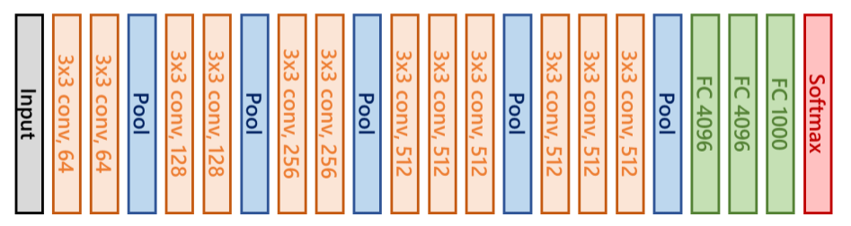

# Introduction to Transfer Learning (Cat vs Non-cats Project)  
This project references taken by https://cloudxlab.com/
## Cats vs Non-cats using Transfer Learning - What is Transfer Learning?
- Transfer learning has become so handy for computer vision geeks.

- It’s basically a mechanism where the knowledge acquired by training a model for achieving a task is efficiently modified or optimized in order to accomplish the second related task.

- For example, a neural network trained on object recognition can be used to read x-ray scans.

- This is achieved by freezing the weights until the initial or mid-layers are learned on the data for task A, removing the last layer or a few of the last layers, and adding new layers and training those parameters using the data for task B.
## Cats vs Non-cats using Transfer Learning - Why Transfer Learning?
The Transfer Learning technique is very useful because:

- Using a well-trained model which performs really great for task A, we can develop a model which performs elegantly for task B, though we have fewer data available for task B

- There are fewer parameters to be trained (only last layer/layers) and thus less training time,

- There is less demand for heavy computational resources like GPU, TPU (but still depends on the data available for task B).

## Cats vs Non-cats using Transfer Learning - How do we do Transfer Learning?
Transfer learning makes sense when the data in training for task A is quite large and that of task B is relatively smaller.

- By getting trained on such vast amounts of data and showing excellent performance on its test data, this implies that the neural network has a good knowledge of extracting useful features from the input images. This is essential and powerful for achieving a task.

- Now that we have such powerful features from these layers (whose weights from task A are frozen), we just need to make use of these extracted features to achieve task B. So, these features from frozen layers are fed to the new layers, and the parameters for these layers are trained on the data of task B.

So basically, we store the knowledge from the previous task in the form of the weights of the frozen layers (called pre-training). Then we make the neural network task B-specific by training (called fine-tuning) the latter layers on the new data.

- In our project, we will be using pre-trained models which were trained to classify a large set of images(which is the task A), and fine-tune it to make the classifier specific to our classification task of cats vs non-cats(which is task B).

## Cats vs Non-cats using Transfer Learning - What are we going to do now?
- We are going to build a model to classify cats vs non-cats, using transfer learning.
- We are going to build it on top of the pre-trained VGG16 models.
- We shall use the weights of the model, and fine-tune it by adding some layers on top of that, in order to customize it for our own purpose - cat vs non-cat classification.
- We use the same weights of the CNNs by freezing them, and we remove the top(which are dense layers) to add our customized dense layers. The customized top dense layers are trained(which is known as fine-tuning), to make them especially learn about our data set.

## Cats vs Non-cats using Transfer Learning - The VGG16 Model
Firstly, let us know about the VGG16 model pre-trained on the Imagenet database.

- The VGG16 is a trained CNN primarily built to classify 1000 classes of the ImageNet database.

- It is built by using roughly 1.2 million training images, 50,000 validation images, and 150,000 testing images.

## Cats vs Non-cats using Transfer Learning - Workflow

About the Dataset

Dataset is located at /cat-non-cat

Dataset is in .h5 file. It is a file format that could store the data - along with its meta-data - in the form of a hierarchy. Import h5py to interact with a dataset that is stored in an H5 file. It contains
- train_catvnoncat.h5 - a training set of images labeled as cat (y=1) or non-cat (y=0)
- test_catvnoncat.h5 - a test set of images labeled as cat or non-cat
- Each image is of shape (num_px, num_px, 3) where 3 is for the 3 channels (RGB). Thus, each image is square (height = num_px) and (width = num_px) Now, let us load the dataset into our working session.
## Importing the Modules
We are going to use the following modules for this exercise:
- NumPy
- h5py
- matplotlib
- TensorFlow
- tensorflow.keras
## Visualize the Data
The classes of the images in the datasets are cat and non-cat. These labels of each sample are stored in train_set_y_orig, validation_y and test_set_y, where 1 means 'cat' and 0 means 'non-cat'. Let us see how to get this info Pythonically:
## Shape of the data
Let us first split the test data in order to use a part of it for validation purposes. After that, let us have a look at the shape of the train, validation, and test datasets.
## Getting Pre-Trained VGG16 base model
The trained VGG16 model is available with tensorflow.keras.applications. We have imported this as from tensorflow.keras.applications import VGG16 in the Import Modules section.
## Compile the VGG16 model
In addition to adding the custom dense layers to train, we should also mention some other factors like:

- the optimization algorithm
- learning rate
- loss function
- metrics of evaluation and others.
## Visualizing the model
Let us have a complete picture of our new VGG16 model.

We could view that using the summary() method on the vgg_base and vgg_model.

Also, we could visualize them using plot_model, a Keras utility. Let's see how!
